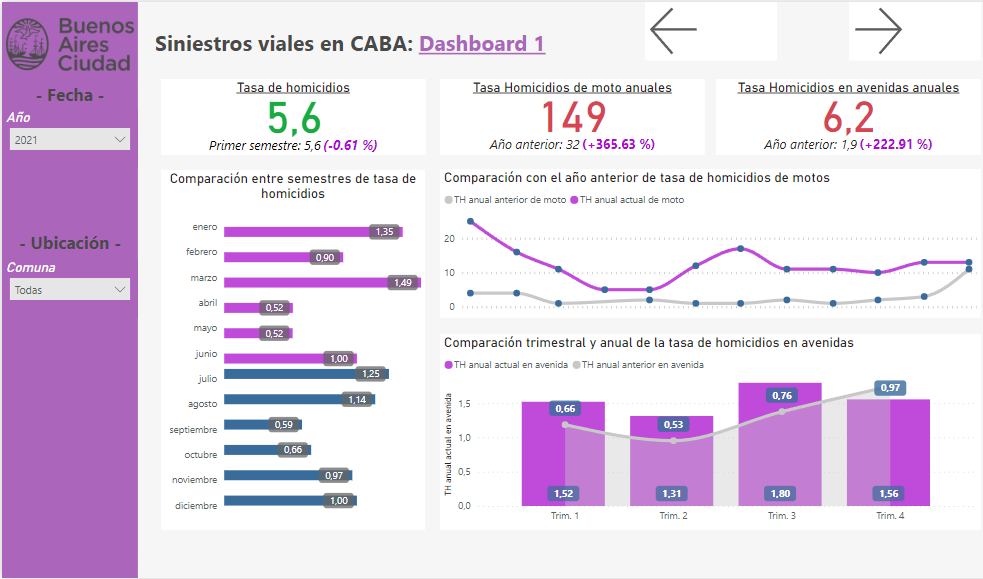
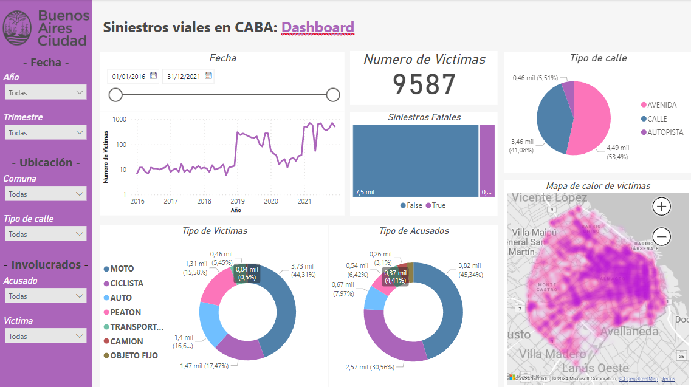
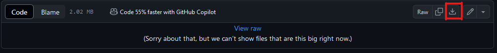

# Proy_siniestros_viales

## **Descripción**

PROYECTO INDIVIDUAL Nº2: **Siniestros viales**
atraves de procesos de tratamientos y analisis de los datos proporcionados, pudimos preparar para su visualizacion y su analisis en busca de insight's.

## **Vista del Dashboard**

## **Analisis**

Para abrir el EDA debera descargar el archivo html y abrirlo en su navegador preferido, aqui le dejo una imagen de donde puede descargarlo:

#### [Análisis de datos exploratorio](./ETL_EDA/siniestros_report_eda.html)

## **Pasos para la instalaciòn del proyecto**

1. Cloná el repositorio.
2. Instala las dependencias del proyecto utilizando el archivo ``requirements.txt``, abriendo el terminal en la carpeta raíz del proyecto y corriendo el comando ``> pip install -r requirements.txt`` en la consola 
3. Ejecuta los archivos dentro de ``/ETL_EDA`` en un entorno de Jupyter Notebook o Google Colab, éste llamara los archivos .xlxs almacenados en ``/Archivos_xlsx.``

## **Tecnologias usadas**

* Power Bi
* matplotlib
* openpyxl
* pandas
* seaborn
* geopandas
* numpy
* ydata-profiling

## **Recursos utiles**

> https://www.datasource.ai/uploads/d8bd6d716a55e75759045076654f51b3.html

> https://data.buenosaires.gob.ar/dataset/?groups=urbanismo-y-territorio

> https://cdn.buenosaires.gob.ar/datosabiertos/datasets/transporte-y-obras-publicas/victimas-siniestros-viales/NOTAS_HOMICIDIOS_SINIESTRO_VIAL.pdf

## **Licencia**

Este proyecto se distribuye bajo la licencia MIT. Consulta el archivo ``LICENSE`` para obtener más detalles.

## **Contacto**

Para obtener más información o realizar preguntas sobre el proyecto, puedes ponerte en contacto con el autor:

* Nombre: Luca Hector Monzon
* Teléfono: +59 11 3095-0937
* Correo Electrónico: lucamonzon2003@gmail.com
